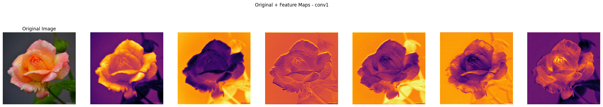
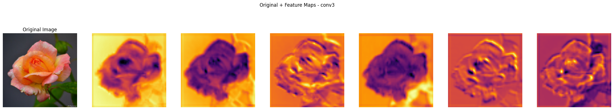
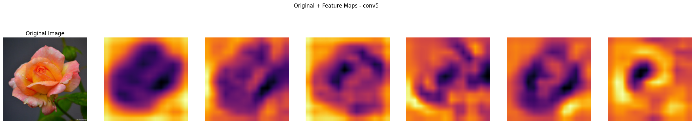
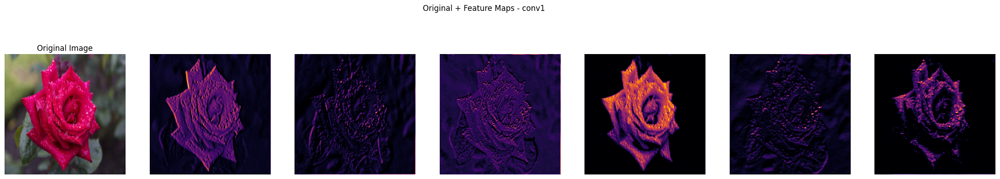
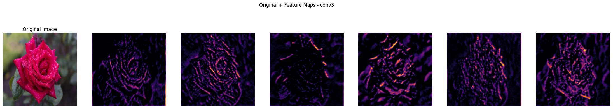
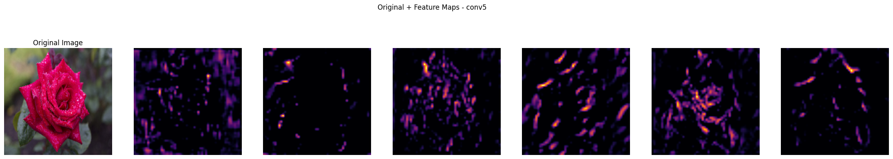

# CNN-based Flower Classification: From Scratch to Transfer Learning

This project focuses on flower classification using deep learning methods. It involves building a custom CNN model from scratch and utilizing VGG16 for transfer learning. The models are trained and visualized using feature visualization strategies proposed by Zeiler & Fergus (2014).

## Project Objective

The project aims to achieve the following:

1. **Custom CNN Model (Model#1)**: Develop a custom CNN model from scratch for flower classification and train it on the dataset.
2. **VGG16 Transfer Learning (Model#2)**: Use the pretrained VGG16 model as a feature extractor and train a classifier on top.
3. **VGG16 Fine-Tuning (Model#3)**: Fine-tune VGG16 on the flower dataset to adapt the model to flower-specific features.
4. **Feature Visualization**: Use the feature visualization method from Zeiler & Fergus (2014) to visualize learned features in different layers of the models.
5. **Performance Comparison**: Compare the performance of the models in terms of accuracy, precision, recall, and F1 score.

## Dataset

The dataset used in this project is the **Flowers Dataset**, which contains five flower categories:

- Daisy
- Dandelion
- Rose
- Sunflower
- Tulip

You can download the dataset from Kaggle using the following link:

[Kaggle - Flowers Dataset](https://www.kaggle.com/datasets/imsparsh/flowers-dataset/data)

After downloading, place the dataset in the `data/` folder of the project directory.

### Trained Models

The trained model files (.pth) are too large to be uploaded directly to GitHub. You can download them from the following Google Drive link:

[Download Trained Models](https://drive.google.com/drive/folders/1Ria1LYbbcQWL9iWrgsEl8WWx8Ny1bdpE?usp=sharing)

Please make sure to place the downloaded models in the `saved_models` folder of your project.

## Model #1: Custom CNN 

### Model Architecture

This model is a **fully custom convolutional neural network (CNN)** designed from scratch. It aims to learn discriminative features for multi-class image classification through deep feature extraction and regularization.

- **Convolutional Layers**:
  - 5 convolutional blocks with increasing depth:
    - Conv1: 3 → 16 filters
    - Conv2: 16 → 32 filters
    - Conv3: 32 → 64 filters
    - Conv4: 64 → 128 filters
    - Conv5: 128 → 128 filters
  - Each conv layer is followed by **ReLU activation** and **max pooling**.

- **Regularization**:
  - **Dropout (40%)** is applied before the fully connected layer to reduce overfitting.

- **Fully Connected Layers**:
  - FC1: `128*7*7` → 128
  - FC2: 128 → 5 (number of classes)

### Training Procedure

- **Data Augmentation**:
  - Includes resizing, random horizontal flipping, and random rotation to improve generalization.
  - Normalization is performed with a mean and std of `[0.5, 0.5, 0.5]`.

- **Optimizer & Loss**:
  - Optimizer: **Adam** with learning rate `0.0005` and weight decay `1e-4`.
  - Loss Function: **CrossEntropyLoss**.

- **Evaluation Metrics**:
  - For each epoch, the following metrics are calculated:
    - Loss
    - Accuracy
    - Precision
    - Recall
    - F1-score (all weighted)

- **Model Checkpointing**:
  - The model with the **highest F1-score** is saved to `saved_models/custom_cnn_best.pth`.

### Implementation Highlights

- Clean modular code with:
  - A dedicated `CustomCNN` class.
  - A `train_and_evaluate` function that handles the entire training and validation process.
  - Reproducible and scalable structure for future enhancements.
  - Includes feature map visualization from layers `conv1`, `conv3`, and `conv5`, saved as images for interpretability (`saved_images/custom_cnn/`).

- **Training Duration** is timed and reported.

### Visualizations

#### Conv1 Feature Maps

Here, we visualize the feature maps from the first convolutional layer (`conv1`). The feature maps highlight the initial low-level features the model detects from the input images.

#### Conv3 Feature Maps

These are the feature maps from the third convolutional layer (`conv3`). As the depth of the layers increases, the feature maps become more complex and represent more abstract features.

#### Conv5 Feature Maps

The feature maps from the fifth convolutional layer (`conv5`) show the high-level, abstract features that are most relevant for classifying the images into their respective categories.

### Source Code

- **Model definition** → `models/custom_cnn.py`  
- **Training script** → `train/train_custom_cnn.py`
- **Visualization script** → `visualize/visualize_custom_cnn.py`
 

## Model #2: VGG16 - Feature Extractor

### Model Architecture

This model leverages the **pre-trained VGG16** architecture, using it as a fixed feature extractor. All convolutional layers are **frozen**, meaning their parameters are not updated during training. Only the classifier section (fully connected layers) is retrained to adapt to the new classification task.

- **Convolutional Layers**: All layers are frozen to retain pre-learned features from ImageNet.
- **Classifier Architecture**:
  - Fully connected layer with input size 25088 → 512
  - ReLU activation
  - Dropout layer with 30% rate
  - Final linear layer mapping 512 → `num_classes` (5 in this case)

### Training Procedure

Only the classifier layers are trained, while the convolutional backbone remains fixed. The training process includes the following steps:

- **Data Preprocessing**:
  - Images are randomly cropped to 224x224 and normalized.
  - Data augmentation includes horizontal flipping and random rotations to improve generalization.

- **Optimization**:
  - Only the classifier parameters are updated using the Adam optimizer.
  - CrossEntropyLoss is used as the loss function.

- **Early Stopping**:
  - Training is halted if the validation F1-score does not improve for 3 consecutive epochs.
  - The best-performing model (based on validation F1-score) is saved.

- **Evaluation Metrics**:
  - At the end of each epoch, both training and validation are evaluated using:
    - Loss
    - Accuracy
    - Precision
    - Recall
    - F1-score

### Implementation Highlights

- Pre-trained VGG16 is used as a fixed feature extractor with frozen conv layers.  
- Custom classifier head is trained for the new task.  
- Includes early stopping and best model saving based on validation F1-score.  
- Training metrics are logged per epoch; total training time is reported.

### Source Code

You can find the full implementation of the model architecture and training logic in the following directories:

- **Model definition** → `models/vgg16_feature_extractor.py`
- **Training script** → `train/train_vgg16_feature_extractor.py`
 

## Model #3: VGG16 - Fine-Tuning

### Model Architecture

This model builds on the pre-trained **VGG16** architecture and applies **selective fine-tuning** to improve performance while reducing overfitting and training time.

- **Feature Extraction**:
  - Only the first convolutional block (first 5 layers) is **frozen** to retain low-level features.
  - All remaining layers are **trainable**, allowing the model to adapt to the new dataset.

- **Classifier Modification**:
  - The original fully connected layers are replaced with a custom classifier:
    - Linear layer from 25088 to 512
    - ReLU activation
    - Dropout (30%) for regularization
    - Final linear layer mapping 512 to the number of output classes (`num_classes = 5`)

### Training Procedure

The training process fine-tunes most of the VGG16 network except the first convolutional block. This allows the model to learn task-specific representations while leveraging pre-trained knowledge.

- **Data Preprocessing**:
  - Images are resized to 224x224.
  - Standard normalization (ImageNet mean and std) is applied.

- **Optimization Strategy**:
  - Uses **Adam optimizer** with a low learning rate (0.0001) for stable fine-tuning.
  - Only the parameters with `requires_grad=True` are updated during training.
  - The loss function is **CrossEntropyLoss**.

- **Early Stopping and Model Checkpointing**:
  - If validation accuracy does not improve for 3 consecutive epochs, training stops early.
  - The best model (with highest validation accuracy) is saved.

- **Evaluation Metrics**:
  - Each epoch evaluates the model using:
    - Loss
    - Accuracy
    - Precision
    - Recall
    - F1-score
  - Metrics are calculated for both training and validation phases.

### Implementation Highlights

- Pre-trained VGG16 is used with the first 5 convolutional layers frozen, and only the classifier is fine-tuned.
- Custom classifier head is added with 512 neurons and 5 output classes.
- Early stopping is implemented based on validation accuracy, and the best model is saved.
- Activation maps from conv1, conv3, and conv5 layers are visualized.
- Training metrics are logged per epoch; total training time is reported.

### Visualizations

#### Conv1 Feature Maps

The following visualizes the feature maps from the first convolutional layer (`conv1`) of the fine-tuned VGG model. These feature maps represent low-level features that help the model understand basic patterns in images.

#### Conv3 Feature Maps

These are the feature maps from the third convolutional layer (`conv3`). The deeper layers capture more complex patterns relevant to the task at hand.

#### Conv5 Feature Maps

Here are the feature maps from the fifth convolutional layer (`conv5`). These maps capture higher-level features that are more abstract and closer to the decision-making stage of the model.

### Source Code

To view or modify the full implementation:

- **Model definition** → `models/vgg16_finetuning.py`
- **Training script** → `train/train_vgg16_finetuning.py`
- **Visualization script** → `visualize/visualize_vgg_finetuning.py`

## Performance Comparison

| **Model**              | **Accuracy** | **Precision** | **Recall** | **Train Time (s)** | **Train Loss** | **Val Loss** | **F1-Score** |
|------------------------|------------------|---------------|------------|--------------------|----------------|--------------|--------------|
| **Custom CNN**          | 0.7582         | 0.7590          | 0.7582      | 292.21                | 0.6249          | 0.7007          | 0.7566          |
| **VGG16(Feature Extractor)** | 0.8655             | 0.8647           | 0.8677     | 771.01               | 0.3960            | 0.3818         | 0.8652         |
| **VGG16(Fine-Tuned)** | 0.9236             | 0.9244           | 0.9242       | 990.18               | 0.0137           | 0.3623         | 0.9241         |

### Performance Results

The performance of the three models (Custom CNN, VGG16 Feature Extractor, and VGG16 Fine-Tuning) has been evaluated based on accuracy, precision, recall, F1-score, training time, and loss values.

1. **Custom CNN**:
   - Achieved a reasonable **accuracy of 75.82%** with a relatively fast training time of **292.21 seconds**.
   - The model shows balanced performance with a **precision**, **recall**, and **F1-score** of **0.7566**.
   - Despite being a custom-built model, its validation performance shows that it can handle multi-class classification tasks adequately.

2. **VGG16 Feature Extractor**:
   - Achieved **accuracy of 86.55%**, benefiting from the power of pre-trained features and a customized classifier, showing a significant improvement compared to the Custom CNN.
   - The **F1-score of 0.8652** demonstrates strong performance in both precision and recall.
   - However, with a training time of **771.01 seconds**, this model is slower due to the larger pre-trained model, but it still delivers good results.

3. **VGG16 Fine-Tuning**:
   - Achieved the highest **accuracy of 92.36%** and a remarkable **precision**, **recall**, and **F1-score** of **0.9241**.
   - Despite the **990.18 seconds** training time, the fine-tuning approach has shown a significant performance improvement over the Custom CNN and Feature Extractor models.

### Conclusion
- The **VGG16 Fine-Tuning** model shows the power of fine-tuning pre-trained models for specific tasks, outpacing other models by a significant margin.
- The **VGG16 Feature Extractor** also performed well, achieving good results with a shorter training time compared to fine-tuning.
- The **Custom CNN**, while simpler in architecture, still achieved a good performance, providing a solid baseline for comparison.

This project was completed as part of the SE3508 Introduction to Artificial Intelligence course,
instructed by Dr. Selim Yılmaz, Department of Software Engineering at Muğla Sıtkı Koçman
University, 2025.
� Note: This repository must not be used by students in the same faculty in future years—whether
partially or fully—as their own submission. Any form of code reuse without proper modification and
original contribution will be considered by the instructor a violation of academic integrity policies.

